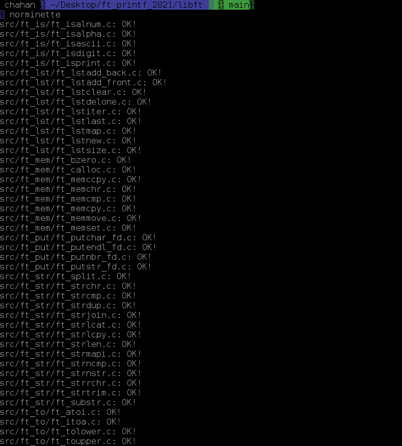
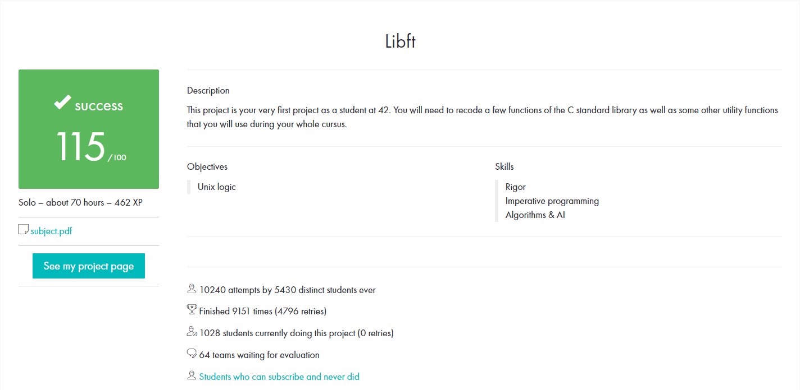

# libft_2021+ version


<br>
norminette was changed to v3<br>
<br>

---

# How to Run

```
1. move to `src` folder<br>
2. Enter the `make`<br>
```

- make library file : make<br>
- clean obj files : make clean<br>
- clean target/lib/obj file : make - fcelan<br>
- make again : make re<br>
- checkout norm : make norm<br>

---

# Evaluation



---

# Tester

https://github.com/Tripouille/libftTester
